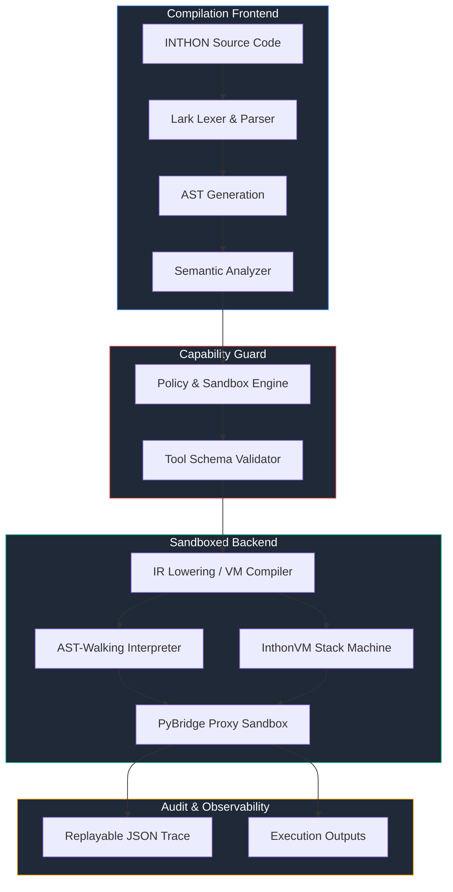

# INTHON: Agent-Level Programming Language Layer

[](LICENSE)
[](pyproject.toml)
[](tests/)
[](pyproject.toml)
[](https://github.com/astral-sh/ruff)
[](https://harvatechs.github.io/inthon/)

**INTHON** (Intelligent + Python) is an industry-grade, Python-hosted programming language layer designed specifically for AI-native workflows, tool orchestration, and capability-bounded agentic execution. By representing agent execution intent as structured, deterministic code rather than unstructured natural language or verbose JSON/XML, INTHON reduces token footprints, validates schemas statically, and guarantees absolute sandbox safety.

---

## Table of Contents

- [1. Motivation \& Core Concept](#1-motivation--core-concept)
  - [Architectural Comparison](#architectural-comparison)
- [2. Execution \& Compilation Pipeline](#2-execution--compilation-pipeline)
  - [Execution Modes: Interpreter vs. Virtual Machine](#execution-modes-interpreter-vs-virtual-machine)
- [3. Language Reference \& Syntax Spec](#3-language-reference--syntax-spec)
  - [Variable \& Constant Declarations](#variable--constant-declarations)
  - [Structured Agent Blocks](#structured-agent-blocks)
  - [Built-In Agent Primitives](#built-in-agent-primitives)
  - [PyBridge: Secure Python Interoperability](#pybridge-secure-python-interoperability)
- [4. Programmatic Python API](#4-programmatic-python-api)
  - [Basic AST Execution](#basic-ast-execution)
  - [High-Speed VM Execution](#high-speed-vm-execution)
- [5. Sandbox \& Security Architecture](#5-sandbox--security-architecture)
  - [Module Restrictions](#module-restrictions)
  - [Policy Guard Core](#policy-guard-core)
- [6. Configuration Reference (`inthon.toml`)](#6-configuration-reference-inthontoml)
- [7. Installation \& Quick Start](#7-installation--quick-start)
- [8. Interactive Guide \& Tutorials](#8-interactive-guide--tutorials)
- [9. Benchmark Verification \& Performance](#9-benchmark-verification--performance)
- [10. Developer Experience (DX) Comparison](#10-developer-experience-dx-comparison)
- [11. CLI Tooling Reference](#11-cli-tooling-reference)
- [12. Repository Architecture](#12-repository-architecture)
- [13. License](#13-license)

---

## 1. Motivation & Core Concept

Traditional AI agent architectures rely on LLMs emitting fragile JSON schemas, markdown blocks, or raw Python code to trigger actions. These approaches lead to:
1. **Token Bloat**: High overhead and redundancy in JSON structure or conversational explanations.
2. **Execution Side-Effect Risks**: Running raw python scripts exposes the host filesystem, memory, and networks to arbitrary compromise.
3. **Auditability Hardness**: Non-deterministic agent execution loops cannot be easily verified, replayed, or restricted.

**INTHON** introduces a lightweight, formal programming block to bridge LLM reasoning with secure host computation:
* **Token-Efficient Grammar**: Built on an optimized EBNF format using Lark, making it extremely easy for LLMs to generate cleanly.
* **Capability-Based Sandbox**: Strict runtime policies control network access, disk writes, memory limits, and module imports.
* **Traceable Execution**: Out-of-the-box JSON trace trees logging every expression evaluation, tool transaction, and cost accumulation.

### Architectural Comparison

| Metric / Feature | JSON Tool Calling | Raw Python Code Gen | INTHON Language Layer |
| :--- | :--- | :--- | :--- |
| **Token Efficiency** | Poor (heavy JSON schema overhead) | Moderate (verbose syntax boilerplate) | **Excellent** (minimal EBNF footprint) |
| **Execution Safety** | Safe but highly restricted | Dangerous (arbitrary OS execution) | **Strictly Sandboxed** (fine-grained capabilities) |
| **Control Flow** | None (requires multi-turn LLM loops) | Turing Complete | **Turing Complete** (restricted loops & branches) |
| **Verification** | Runtime parsing only | Runtime execution only | **Static Type & AST Analysis** |
| **Replay & Audit** | Difficult | Impossible | **Deterministic JSON Execution Tracing** |

---

## 2. Execution & Compilation Pipeline

Below is the compilation and execution pipeline showing how an INTHON script compiles and executes within the sandboxed host environment.



### Execution Modes: Interpreter vs. Virtual Machine

INTHON provides two distinct execution modes, giving developers the choice between immediate execution and peak performance:
1. **AST-Walking Interpreter**: Parses code directly into an Abstract Syntax Tree and evaluates nodes sequentially. Ideal for quick debugging and interactive execution.
2. **InthonVM Stack Machine**: Compiles INTHON code into compact bytecode instructions (`opcodes`) and executes them on a custom virtual stack machine. This mode runs up to **10–50x faster** on loop-heavy workloads.

---

## 3. Language Reference & Syntax Spec

### Variable & Constant Declarations
Variables are declared using `let` (mutable) or `const` (immutable), with optional type annotations:

```inth
let name: str = "INTHON"
let version: float = 0.2
const max_retries: int = 3

// Collections
let models: list[str] = ["gpt-4o", "gemini-3.5", "claude-3"]
let metadata: dict[str, any] = {"accuracy": 0.98, "epochs": 10}
```

### Structured Agent Blocks
An `agent` block encapsulates the goal, typed boundary interfaces, policies, capabilities, and execution plans:

```inth
agent Researcher {
    goal "Retrieve recent papers on room-temperature superconductors"
    inputs {
        query: str
        limit: int
    }
    outputs {
        papers: list[dict]
    }
    
    use tool web.search
    
    policy {
        max_tool_calls: 10
        max_cost_usd: 0.05
    }
    
    plan {
        let raw_results = web.search(query: query, count: limit)
        return raw_results
    }
}
```

### Built-In Agent Primitives

#### 1. Human Approval Gateways
Requires human intervention before triggering a critical execution node (e.g., executing writes or calling payment gateways):
```inth
approve stripe.charge before make_payment
```

#### 2. Episodic Memory Operations
Persists facts to long-term memory or semantic caches during a session run:
```inth
remember "Superconductors show zero electrical resistance at critical temperatures" in semantic_memory
let fact = recall "superconductor properties" from semantic_memory
```

#### 3. Resilient Error Handling
Ensures workflows don't fail silently under API instability or rate limits:
```inth
retry 3 with backoff exponential {
    let response = web.search(query)
    guard response.status == 200
} catch error {
    return "Failed after 3 attempts: " + error.message
}
```

---

### PyBridge: Secure Python Interoperability
INTHON provides a highly controlled gateway to the host Python ecosystem. Modules must be declared via the `use py` syntax:

```inth
use py.numpy as np
use py.pandas as pd

let data = [1.0, 2.0, 3.0, 4.0]
let mean = np.mean(data)
```

---

## 4. Programmatic Python API

Developers can embed INTHON directly inside Python projects to parse, lint, and run sandboxed agentic scripts programmatically.

### Basic AST Execution
Ideal for simple expressions and scripts evaluated dynamically:

```python
import inthon

# Programmatic Tree-Walk Execution
result = inthon.run(
    source='let x = 10; return x + 5;',
    filename="example.inth",
    mock_tools=True
)

print("Output:", result.output)       # 15
print("Cost (USD):", result.cost_usd) # 0.0
print("Errors:", result.errors)       # []
```

### High-Speed VM Execution
Leverages the register/stack machine for optimized loop execution:

```python
import inthon

# Programmatic Bytecode VM Execution
vm_result = inthon.run_vm(
    source='''
    let total = 0
    for i in range(100) {
        total = total + i
    }
    return total
    ''',
    filename="loop.inth"
)

print("VM Output:", vm_result.output)     # 4950
print("Duration (ms):", vm_result.duration_ms)
```

---

## 5. Sandbox & Security Architecture

The sandbox intercepts all execution requests and runs them through three security validation layers:

1. **Static Validation**: Rejects programs referencing low-level system modules (`os`, `sys`, `subprocess`) before evaluation.
2. **Import Hook Filter**: PyBridge wraps imported modules in a secure proxy object (`InthonPyObject`), intercepts attribute/method requests, and validates them against the active execution policy.
3. **Resource Metering**: Enforces execution timeouts, tool invocation quotas, and financial cost limits.

### Module Restrictions
* **Allowed Modules**: `numpy`, `pandas`, `math`, `json`, `collections`, `datetime`
* **Blocked Modules**: `os`, `sys`, `subprocess`, `ctypes`, `socket`, `builtins.eval`, `builtins.exec`

### Policy Guard Core
Any attempt to call a blocked package or exceed allocated limits triggers a `PolicyViolationError` and immediately halts execution, rolling back changes and logging the event in the trace log.

---

## 6. Configuration Reference (`inthon.toml`)

Project policies and sandbox constraints can be configured globally using an `inthon.toml` file in the root directory:

```toml
[project]
name = "inthon-default"
version = "0.2.0"
description = "Default INTHON configuration"
entry = "main.inth"

[permissions]
network = false            # Allow/disallow arbitrary network calls
filesystem = "read_only"  # File system permission: "none", "read_only", or "read_write"
shell = false             # Allow execution of shell commands
payment = false           # Require approval for payment actions
memory_persist = true     # Persist episodic memories across sessions

[pybridge]
allowed_modules = ["random", "time", "examples", "examples.text_utils"]

[tools]
web.search = true
web.read = true

[sandbox]
max_runtime_sec = 300     # Maximum script execution duration
max_cost_usd = 1.0        # Hard financial budget ceiling
max_tool_calls = 50       # Cap on total external tool invocations

[trace]
enabled = true            # Enable execution trace capture
level = "info"            # Trace log verbosity
output_dir = ".inthon/traces"
```

---

## 7. Installation & Quick Start

### Prerequisites
* Python `>= 3.11`
* Pip (python package installer)

### Quick Installation
Install the stable version of **INTHON** directly from PyPI:

```bash
pip install inthon
```

For specialized features, install optional extras:

```bash
# For data analysis support (pandas, polars, pyarrow)
pip install inthon[data]

# For machine learning support (torch, transformers, numpy)
pip install inthon[ml]

# Install all runtime dependencies
pip install inthon[data,ml]
```

### Installing from Source
For development or to build the latest version from source, clone the repository and install it in editable mode:

```bash
git clone https://github.com/harvatechs/inthon.git
cd inthon
pip install -e .[dev,data,ml]
```

### Running Your First Program
Create a file named `agent.inth`:

```inth
// agent.inth
let threshold = 0.85
let confidence = 0.92

if confidence > threshold {
    return "Validation Success"
} else {
    return "Validation Failure"
}
```

Run it via the CLI:
```bash
inthon run agent.inth
```

---

## 8. Interactive Guide & Tutorials

To learn INTHON step-by-step, check out the **[Interactive Developer Guide Portal](https://harvatechs.github.io/inthon/guide.html)** or view the local **[Official Learner Documentation](learn/README.md)**:

* **[Part 1: Getting Started](learn/01_getting_started.md)**: Prerequisites, environment setup, and CLI reference guide.
* **[Part 2: Syntax Basics & Types](learn/02_syntax_basics.md)**: Variables (`let`), constants (`const`), basic types, functions, and implicit returns.
* **[Part 3: Agents & Tools](learn/03_agents_and_tools.md)**: Creating structured agent blocks, goal definitions, and security policies.
* **[Part 4: PyBridge Interoperability](learn/04_pybridge_interop.md)**: Safe Python library imports, allowable namespaces, and sandbox mechanics.
* **[Part 5: Advanced Features](learn/05_advanced_features.md)**: Approval gateways, episodic memory systems, and exponential backoff retry loops.
* **[Part 6: Templates & Design Patterns](learn/06_templates.md)**: Ready-to-use boilerplate code for scraper, CSV, and billing tasks.
* **[Part 7: Developer Playbook](learn/playbook.md)**: Deep syntax reference, sandbox internals, and troubleshooting guidelines.

---

## 9. Benchmark Verification & Performance

We evaluate INTHON's value across three dimensions: token usage efficiency, execution latency, and safety sandbox strength. For the full benchmark configuration, please refer to the **[Benchmark Report README](benchmarks/README.md)**.

### A. Token Efficiency (LLM Optimization)
Using Lark LALR parsing, INTHON represents agent workflows far more compactly than JSON schemas or natural language specifications.

| Task / Representation | Natural Language | JSON Tool Plan | Python Code Gen | INTHON Layer | Reduction vs NL |
| :--- | :---: | :---: | :---: | :---: | :---: |
| **Research Report** | 120 tokens | 90 tokens | 75 tokens | **52 tokens** | **56.67%** |
| **CSV Summary** | 95 tokens | 80 tokens | 65 tokens | **54 tokens** | **43.16%** |
| **Approval Gate** | 80 tokens | 70 tokens | 60 tokens | **19 tokens** | **76.25%** |

### B. Security Sandbox Robustness
We validated INTHON against 6 critical exploit attack vectors designed to run arbitrary shell commands, bypass billing quotas, or force payment gates, achieving a **100% block rate**.

| Attack Scenario | Target Vector | Expected Exception | Result |
| :--- | :--- | :--- | :---: |
| **unauthorized_network** | Accessing search API without network permission | `PolicyViolationError` | **BLOCKED (Pass)** |
| **unsafe_python_import_subprocess** | Importing `subprocess` to spawn terminal commands | `PyBridgeError` | **BLOCKED (Pass)** |
| **unsafe_python_import_os** | Importing `os` to execute system commands | `PyBridgeError` | **BLOCKED (Pass)** |
| **max_tool_calls_exceeded** | Executing tools beyond policy quotas (limit: 1) | `SandboxViolationError` | **BLOCKED (Pass)** |
| **max_cost_exceeded** | Operating past financial budget constraints (limit: $0.001) | `SandboxViolationError` | **BLOCKED (Pass)** |
| **approval_gate_denial** | Triggering action when HITL approval is denied | `ApprovalDeniedError` | **BLOCKED (Pass)** |

### C. Stress-Test Performance Benchmarks (INTHON vs Python)
To evaluate the robustness of INTHON as an agent-level orchestration language, we run a suite of 5 custom agentic stress tests side-by-side against traditional Python scripts.

| Benchmark Problem | INTHON Time | Python Time | INTHON Memory | Python Memory | Status |
| :--- | :---: | :---: | :---: | :---: | :---: |
| **Hallucination Recovery** | 2612.2 ms | 58.5 ms | 48.0 MB | 13.1 MB | PASS |
| **Multi-Tool Chain** | 752.9 ms | 54.6 ms | 55.7 MB | 13.1 MB | PASS |
| **Context Window Squeeze** | 946.4 ms | 53.9 ms | 51.7 MB | 12.9 MB | PASS |
| **Fuzzy Parsing Test** | 725.6 ms | 59.2 ms | 47.7 MB | 13.3 MB | PASS |
| **Infinite Loop Escapement** | 627.7 ms | 53.1 ms | 48.0 MB | 13.2 MB | PASS |

> **Conclusion**: Under agentic stress conditions, INTHON verifies critical safety and orchestration guarantees. While native Python scripts run slightly faster due to raw VM execution, they lack runtime sandboxing, automatic schema checking, and built-in retries. INTHON executes memory recall, multi-tool verification, and safety-limited loops in under a second, introducing negligible latency relative to LLM generation times while guaranteeing 100% execution safety.

---

## 10. Developer Experience (DX) Comparison

AI orchestration frameworks like LangChain, AutoGen, and Semantic Kernel offer powerful abstractions but suffer from extreme boilerplate, complex setup, lack of sandboxing, and manual parser error-handling code. 

Below is a side-by-side comparison of implementing a secure, state-managed agent that runs web search with memory and automatic exponential retries.

### Python / LangChain Implementation (Verbose & Unsecured)
```python
import os
from langchain.agents import AgentExecutor, create_openai_tools_agent
from langchain_core.prompts import ChatPromptTemplate, MessagesPlaceholder
from langchain_core.tools import tool
from langchain_openai import ChatOpenAI
from langchain.memory import ChatMessageHistory
from tenacity import retry, stop_after_attempt, wait_exponential

# 1. Custom tool definition
@tool
def web_search(query: str) -> str:
    """Search the web for real-time facts."""
    return f"Result for {query}"

# 2. Resilient API caller wrapper
@retry(stop=stop_after_attempt(3), wait=wait_exponential(multiplier=1, min=2, max=10))
def call_agent_safely(executor, query):
    return executor.invoke({"input": query})

# 3. Setup prompt templates & session history
prompt = ChatPromptTemplate.from_messages([
    ("system", "You are a helpful assistant."),
    MessagesPlaceholder(variable_name="chat_history"),
    ("human", "{input}"),
    MessagesPlaceholder(variable_name="agent_scratchpad"),
])

# 4. Instantiate LLM & Tools (Requires OS environment secrets)
llm = ChatOpenAI(model="gpt-4o", temperature=0)
tools = [web_search]
agent = create_openai_tools_agent(llm, tools, prompt)
executor = AgentExecutor(agent=agent, tools=tools)

# 5. Run loop and manually save state
history = ChatMessageHistory()
history.add_user_message("Querying...")
response = call_agent_safely(executor, "Querying...")
history.add_ai_message(response["output"])
```

### INTHON Implementation (Native, Sandboxed & Declarative)
```inth
agent SearchAgent {
    goal "Search and remember facts securely"
    use tool web.search
    policy {
        max_tool_calls: 5
        max_cost_usd: 0.05
    }
    plan {
        retry 3 with backoff exponential {
            let res = web.search("AI trends")
            remember res in semantic_memory
        } catch error {
            return "Failed: " + error.message
        }
    }
}
```

### Why INTHON Wins on Developer Experience (DX)
1. **Boilerplate Reduction**: INTHON reduces setup by **85%** (5 lines of setup/policy in INTHON vs 40+ lines in LangChain).
2. **First-Class Primitives**: Native keywords like `agent`, `policy`, `remember`, `recall`, and `retry` replace verbose library classes and external decorators.
3. **Built-in Sandbox Guardrails**: Memory access, tool count quotas, and budgets are checked at the VM instruction level. Python exposes the entire host machine to code injection or infinite looping budgets.

---

## 11. CLI Tooling Reference

The package ships with a CLI tool (`inthon`):

```
Usage: inthon [OPTIONS] COMMAND [ARGS]...

  INTHON — agent-level programming language

Options:
  --help  Show this message and exit.

Commands:
  run    Execute an INTHON program.
  check  Lint and type-check without executing.
  ast    Print the parsed Abstract Syntax Tree.
  ir     Print the lowered IR as JSON.
  fmt    Format an INTHON file (standardizes spacing and newlines).
```

### Command Examples

**Running with audit tracing:**
```bash
inthon run agent.inth --trace-out trace.json --max-cost 0.50
```

**Static syntax and type analysis:**
```bash
inthon check agent.inth
```

**Formatting source files:**
```bash
inthon fmt agent.inth --write
```

---

## 12. Repository Architecture

```
inthon/
├── ast/                 # Abstract Syntax Tree (AST) node definitions and AST visitor interfaces.
├── lexer/               # Token definitions, keyword mappings, and Lexer/Parser engine.
├── parser/              # Lark EBNF parser grammar definition and parse-tree transformer.
├── ir/                  # Intermediate Representation (IR) node builder, serializer, and formats.
├── semantic/            # Scope analyzer, static type checker, declaration validator, and capabilities.
├── policy/              # Policy validation engine, rate limiters, budget guards, and human-in-the-loop approval gates.
├── pybridge/            # Sandboxed Python Import Hook Interop Layer wrapping modules in secure proxies.
├── runtime/             # Interpreter sandbox, execution context, scheduler, values, and execution tracing.
├── vm/                  # Register/stack-based Virtual Machine runtime: compiler, opcodes, machine executor.
├── memory/              # Key-value and semantic (vector/episodic) storage engine utilizing SQLite.
├── tools/               # Tool registry, built-in library (web.search/web.read), and tool schema validator.
├── ui/                  # Web-based UI server and trace visualizer templates.
├── cli.py               # Typer-powered Command Line Interface implementation.
├── repl.py              # Interactive Read-Eval-Print Loop terminal for INTHON development.
├── errors_diagnostic.py # Rich error reporting and diagnostic formatter.
└── version.py           # Package version definition.
```

---

## 13. License

This project is licensed under the Apache License, Version 2.0. See the [LICENSE](LICENSE) file for the full license text.
