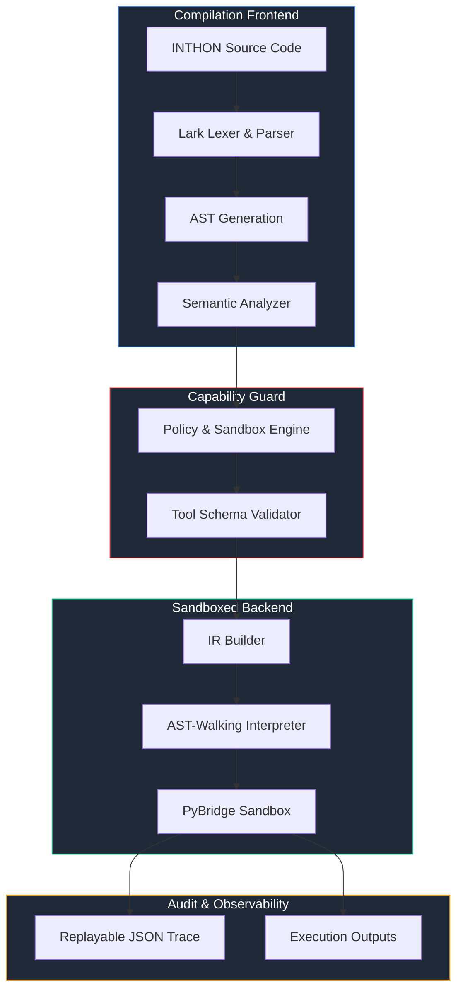

# INTHON: Agent-Level Programming Language Layer

[](LICENSE)
[](pyproject.toml)
[](tests/)
[](https://github.com/astral-sh/ruff)

**INTHON** (Intelligent + Python) is a Python-hosted language layer designed specifically for AI-native workflows, tool orchestration, and capability-bounded execution. By representing agent execution intent as structured, deterministic code rather than unstructured natural language or verbose JSON/XML, INTHON reduces token footprint, validates schemas statically, and guarantees absolute safety.

---

## Table of Contents

- [1. Motivation & Core Concept](#1-motivation--core-concept)
- [2. Architectural Pipeline](#2-architectural-pipeline)
- [3. Language Reference & Syntax Spec](#3-language-reference--syntax-spec)
  - [Variable & Constant Declarations](#variable--constant-declarations)
  - [Structured Agent Declarations](#structured-agent-declarations)
  - [Agent Primitives (Approval, Memory, Resiliency)](#agent-primitives-approval-memory-resiliency)
  - [PyBridge: Secure Python Interoperability](#pybridge-secure-python-interoperability)
- [4. Installation & Quick Start](#4-installation--quick-start)
- [5. CLI Tooling Reference](#5-cli-tooling-reference)
- [6. Development & Verification](#6-development--verification)
- [7. Repository Standards](#7-repository-standards)
- [8. License](#8-license)

---

## 1. Motivation & Core Concept

Traditional AI agent designs rely on LLMs outputting fragile JSON, markdown blocks, or raw Python code to trigger actions. These approaches lead to:
1. **Token Bloat**: Redundant syntax in JSON schemas and natural language formatting.
2. **Side-Effect Risks**: Executing raw Python exposes the underlying OS, filesystems, and networks to arbitrary compromise.
3. **Audit Hardness**: Non-deterministic agent loops cannot be easily replayed, analyzed, or restricted post-generation.

**INTHON** introduces a lightweight, formal language block that bridges LLM reasoning with secure host computation:
*   **Token-Efficient Grammar**: Built using an optimized EBNF format using Lark, making it extremely easy for LLMs to generate cleanly.
*   **Capability-Based Sandbox**: Strict runtime policies control network access, disk writes, memory limits, and module imports.
*   **Traceable Execution**: Out-of-the-box JSON trace trees logging every expression evaluation, tool transaction, and cost accumulation.

---

## 2. Architectural Pipeline

Below is the execution pipeline showing how an INTHON script compiles and executes within the host environment.



### Compiler Stages:
1.  **Lex & Parse**: Tokenizes and validates grammar constraints using Lark's Earley/LALR parser engine.
2.  **AST Generation**: Translates concrete parses into an immutable abstract syntax tree representing expressions and declarations.
3.  **Semantic Analyzer**: Resolves scope bindings, checks static type annotations, and catches undeclared tools or modules before running.
4.  **Policy & Guard**: Applies configuration constraints (e.g. rate limits, billing caps, execution timeouts).
5.  **Sandbox Runtime**: Evaluates lowered code, intercepts side-effect-prone system calls, and maps secure functions to the host OS.

---

## 3. Language Reference & Syntax Spec

### Variable & Constant Declarations
Variables are declared using `let` (mutable) or `const` (immutable), with optional type annotations:

```inth
let name: str = "INTHON"
let version: float = 0.1
const max_retries: int = 3

// Collections
let models: list[str] = ["gpt-4o", "gemini-3.5", "claude-3"]
let metadata: dict[str, any] = {"accuracy": 0.94, "epochs": 10}
```

### Structured Agent Declarations
An `agent` block encapsulates the goal, typed boundary interfaces, policies, capabilities, and execution plans:

```inth
agent Researcher {
    goal "Retrieve recent papers on room-temperature superconductors"
    inputs {
        query: str
        limit: int
    }
    outputs {
        papers: list[dict]
    }
    
    use tool web.search
    
    policy {
        max_tool_calls: 10
        max_cost_usd: 0.05
    }
    
    plan {
        let raw_results = web.search(query: query, count: limit)
        return raw_results
    }
}
```

### Agent Primitives (Approval, Memory, Resiliency)

#### 1. Approval Gateways
Requires human intervention before triggering a specific critical execution node (e.g., executing writes or calling payment gateways):
```inth
approve stripe.charge before make_payment
```

#### 2. Episodic Memory Operations
Persists facts to long-term memory or semantic caches during a session run:
```inth
remember "Superconductors show zero electrical resistance at critical temperatures" in semantic_memory
let fact = recall "superconductor properties" from semantic_memory
```

#### 3. Error Handling and Resiliency
Ensures workflows don't fail silently under API instability or rate limits:
```inth
retry 3 with backoff exponential {
    let response = web.search(query)
    guard response.status == 200
} catch error {
    return "Failed after 3 attempts: " + error.message
}
```

---

### PyBridge: Secure Python Interoperability
INTHON provides a highly controlled gateway to the host Python ecosystem. Modules must be declared via the `use py` syntax:

```inth
use py.numpy as np
use py.pandas as pd

let data = [1.0, 2.0, 3.0, 4.0]
let mean = np.mean(data)
```

#### Security Control Stack:
*   **Allowlist Check**: Only pre-approved packages like `numpy`, `pandas`, `torch`, `transformers`, and basic standard utility libraries are allowed.
*   **Hard Deny**: Low-level modules such as `os`, `sys`, `subprocess`, `ctypes`, and `socket` are strictly blocked.
*   **Method Filtering**: Specific execution gateways like `pandas.eval` and `numpy.frompyfunc` are restricted to prevent escape vectors.

---

## 4. Installation & Quick Start

### Prerequisites
*   Python `>= 3.11`
*   Hatch (recommended for package management and building)

### Installing from Source
Clone the repository and install it in editable developer mode:

```bash
git clone https://github.com/harvatechs/inthon.git
cd inthon
pip install -e .[dev,data,ml]
```

### Writing Your First Program
Create a file named `agent.inth`:

```inth
// agent.inth
let threshold = 0.85
let confidence = 0.92

if confidence > threshold {
    return "Validation Success"
} else {
    return "Validation Failure"
}
```

Run it via the CLI:
```bash
inthon run agent.inth
```

---

## 5. CLI Tooling Reference

The package ships with a rich Command Line Interface (`inthon`):

```
Usage: inthon [OPTIONS] COMMAND [ARGS]...

  INTHON — agent-level programming language

Options:
  --help  Show this message and exit.

Commands:
  run    Execute an INTHON program.
  check  Lint and type-check without executing.
  ast    Print the parsed Abstract Syntax Tree.
  ir     Print the lowered IR as JSON.
  fmt    Format an INTHON file (standardizes spacing and newlines).
```

### Running with audit tracing:
```bash
inthon run agent.inth --trace-out trace.json --max-cost 0.50
```

### Static syntax/type analysis:
```bash
inthon check agent.inth
```

### Formatting files:
```bash
inthon fmt agent.inth --write
```

---

## 6. Development & Verification

For development, install all testing and QA tooling:
```bash
pip install -e .[dev]
```

### Running Tests
Execute the full test suite using pytest:
```bash
pytest --cov=inthon --cov-report=term-missing
```

### Linting and Formatting
Lint and format checking are handled via Ruff:
```bash
# Linting
ruff check .

# Format check
ruff format --check .
```

---

## 7. Repository Standards

We follow the high standards maintained by the CPython developer community:
*   **Clean Separations**: Lexing, parsing, and semantics are isolated into separate standalone directories (`inthon/lexer`, `inthon/parser`, `inthon/semantic`).
*   **Traceability**: No silent errors. Every runtime issue produces a structured execution trace trace mapping error codes to source locations.
*   **100% Core Passing**: No code is merged unless all unit and integration tests pass perfectly on all supported platforms (Windows, Linux, macOS).

---

## 8. License

This project is licensed under the Apache License, Version 2.0. See the [LICENSE](LICENSE) file for the full license text.
