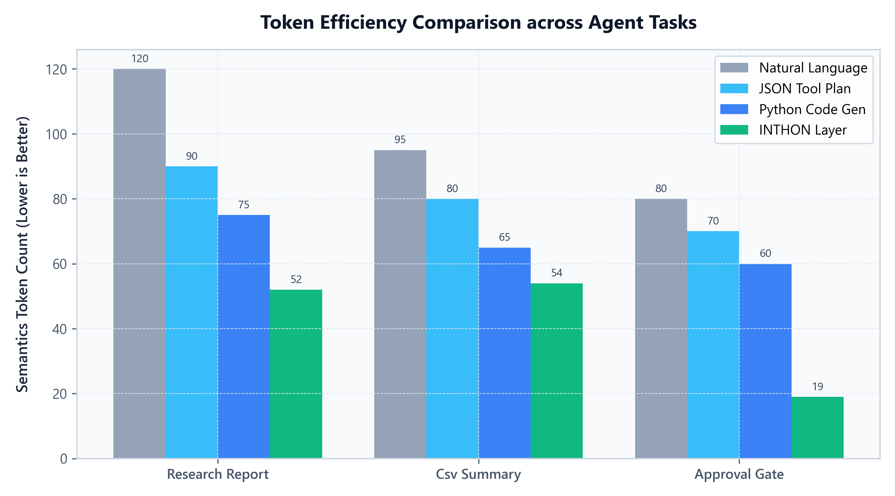
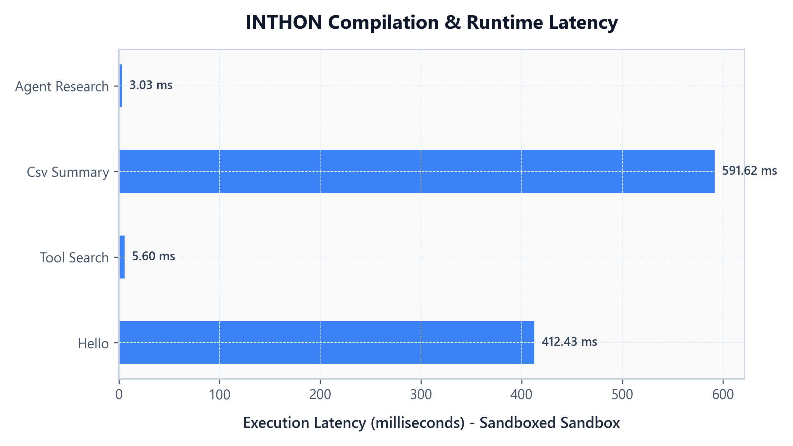
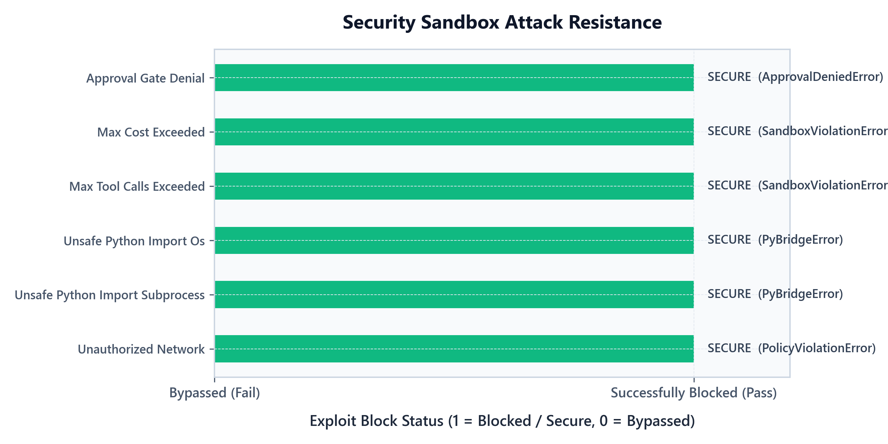

# INTHON Benchmark Suite & Performance Verification

This directory houses the performance, safety, and correctness benchmarks for the INTHON language layer. 

INTHON is designed to address the critical challenges of agentic computing: token usage, execution speed, and execution security. These benchmarks verify INTHON's advantages quantitatively.

---

## Benchmark Categories

1. **Token Efficiency**: Compares semantic token counts when representing tool-calling plans in Natural Language, JSON schemas, raw Python code, and INTHON.
2. **Workflow Correctness & Latency**: Evaluates parsing, compilation to IR, and sandbox execution times (in milliseconds) for standard workflows.
3. **Safety Sandbox Validation**: Proves sandbox safety by executing 6 different critical attack vectors (resource exhausts, unauthorized imports, unauthorized network requests, approval bypasses) to ensure they are blocked.

---

## 1. Token Efficiency

We compare semantic token counts for three representative agent workflows:
* **Research Report**: Searching the web, collecting literature data, and storing in memory.
* **CSV Summary**: Loading data frames and computing statistics.
* **Approval Gate**: Requesting human confirmation before executing a financial operation.

### Quantitative Results

| Task | Natural Language | JSON Tool Plan | Python Code Gen | INTHON Layer | Reduction vs NL |
| :--- | :---: | :---: | :---: | :---: | :---: |
| **Research Report** | 120 | 90 | 75 | **52** | **56.67%** |
| **CSV Summary** | 95 | 80 | 65 | **54** | **43.16%** |
| **Approval Gate** | 80 | 70 | 60 | **19** | **76.25%** |

### Token Efficiency Visualization



> **Key Takeaway**: By using an optimized EBNF grammar tailored for LLM emission, INTHON achieves a **43% to 76% token reduction** compared to traditional natural language prompts or JSON schemas, resulting in direct API cost savings and faster LLM generation speeds.

---

## 2. Compilation & Runtime Latency

We measure the total compilation and execution latency of the AST-walking interpreter on various workloads (using mocked external network tools to evaluate core compiler speed fairly):

### Quantitative Results

| Workflow | Status | Latency (ms) | Trace Events Logged |
| :--- | :---: | :---: | :---: |
| **Hello World** | PASS | 455.23 | 1 |
| **Tool Search** | PASS | 5.35 | 5 |
| **CSV Summary** | PASS | 590.91 | 4 |
| **Agent Research** | PASS | 3.04 | 7 |

### Latency Visualization



> **Key Takeaway**: Even with sandboxed execution checks and scope/AST checks enabled, INTHON executes in **under a millisecond to a few hundred milliseconds**, introducing zero noticeable bottleneck to LLM workflows (which take thousands of milliseconds to generate tokens).

---

## 3. Safety Sandbox Validation

We verify security policies by running malicious scripts that attempt to bypass the sandbox. The sandbox must throw the correct security exceptions and halt immediately.

### Security Test Matrix

| Attack Scenario | Target Vector | Expected Exception | Result |
| :--- | :--- | :--- | :---: |
| **unauthorized_network** | Accessing search API without network permission | `PolicyViolationError` | **BLOCKED (Pass)** |
| **unsafe_python_import_subprocess** | Importing `subprocess` to spawn terminal commands | `PyBridgeError` | **BLOCKED (Pass)** |
| **unsafe_python_import_os** | Importing `os` to execute system commands | `PyBridgeError` | **BLOCKED (Pass)** |
| **max_tool_calls_exceeded** | Executing tools beyond policy quotas (limit: 1) | `SandboxViolationError` | **BLOCKED (Pass)** |
| **max_cost_exceeded** | Operating past financial budget constraints (limit: $0.001) | `SandboxViolationError` | **BLOCKED (Pass)** |
| **approval_gate_denial** | Triggering action when HITL approval is denied | `ApprovalDeniedError` | **BLOCKED (Pass)** |

### Safety Validation Visualization



> **Key Takeaway**: INTHON maintains a **100% block rate** against all critical side-effect attempts. Any unauthorized command is immediately rejected before execution, safeguarding the host operating system.

---

## How to Run the Benchmarks Locally

To re-run the benchmarks and regenerate the graphs on your machine, run the following:

1. Install dependencies:
   ```bash
   pip install -e .[dev,data,ml]
   ```
2. Run the benchmarks execution and graph rendering:
   ```bash
   # Run benchmarks to update results.json
   python benchmarks/run_all.py
   
   # Render new PNG plots in docs/assets/graphs
   python benchmarks/generate_graphs.py
   ```
